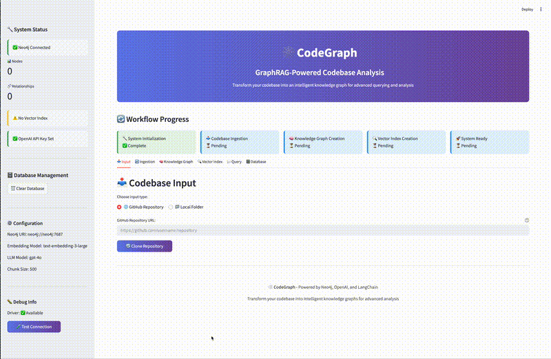

# 🕸️ CodeGraph - GraphRAG Codebase Analysis System

A comprehensive GraphRAG (Graph-based Retrieval-Augmented Generation) system for analyzing and querying codebases using knowledge graphs and vector embeddings, featuring a beautiful Streamlit interface.

## 🌟 Overview

CodeGraph transforms your codebase into an intelligent knowledge system by:
- 🧠 **Building Knowledge Graphs**: Captures relationships between files, functions, classes, and interfaces
- 🔍 **Creating Vector Embeddings**: Enables semantic search using OpenAI's latest embedding models
- 🤝 **Hybrid GraphRAG**: Combines graph traversal with vector search for comprehensive code understanding
- 🎨 **Beautiful UI**: Modern Streamlit interface with real-time feedback and intuitive workflow
- 🗄️ **Smart Database Management**: Persistent data with intelligent session state synchronization

## 🎬 Demo



*Watch CodeGraph in action: from codebase ingestion to intelligent querying*

## ✨ Key Features

### 🎨 Beautiful Streamlit Interface
- **Gradient Header**: Eye-catching purple gradient design with modern typography
- **Real-time Status**: Live Neo4j connection status and system health monitoring
- **Visual Progress**: Step-by-step workflow progress tracker
- **Database Management**: Comprehensive database control with safety features
- **Auto-Sync**: Intelligent detection of existing data with seamless page refresh handling

### 🧠 Advanced GraphRAG Architecture
- **Structural Layer**: Knowledge graphs with entities (`Class`, `Function`, `Interface`, `File`)
- **Semantic Layer**: Vector embeddings (3072-dimensional) for similarity search
- **Bridge Layer**: Smart connections between structural and semantic data
- **Hybrid Queries**: Combines both approaches for superior code understanding

### 🔄 Complete Workflow
1. **📥 Input**: GitHub repositories or local folders with validation
2. **🔄 Ingestion**: Configurable code parsing with progress tracking
3. **🧠 Knowledge Graph**: Configurable LLM-powered entity extraction
4. **🔍 Vector Index**: OpenAI embeddings with text-embedding-3-large
5. **💬 Query**: Natural language queries with rich context display
6. **🗄️ Database**: Management tools with statistics and cleanup options

### 🛡️ Production-Ready Features
- **Session Persistence**: Data persists between browser refreshes
- **Error Handling**: Graceful degradation with helpful error messages
- **Safety Controls**: Multi-step confirmation for destructive operations
- **Performance Monitoring**: Real-time database metrics and health indicators
- **Flexible State Management**: Reset UI without losing database content
- **Configurable LLM**: Use any OpenAI model for entity extraction and responses

## 🚀 Quick Start

### 🐳 Docker Deployment (Recommended)

The fastest way to get CodeGraph running with a single command:

#### Prerequisites
- **Docker** and **Docker Compose**
- **OpenAI API Key**

#### Simple Two-Step Setup

1. **Clone and configure:**
```bash
git clone <repository-url>
cd CodeGraph

# Create your .env file
cat > .env << 'EOF'
NEO4J_URI=neo4j://neo4j:7687
NEO4J_USERNAME=neo4j
NEO4J_PASSWORD=your_secure_password
OPENAI_API_KEY=your_openai_api_key_here
CHUNK_SIZE=500
CHUNK_OVERLAP=50
EMBEDDING_MODEL=text-embedding-3-large
LLM_MODEL=gpt-4o
EOF
```

2. **Run prerequisite check and start:**
```bash
./docker/docker-prerequisite-check.sh
docker compose -f docker/docker-compose.yml up -d
```

3. **Access the application:**
- **CodeGraph UI**: http://localhost:8501
- **Neo4j Browser**: http://localhost:7474

### 🐍 Local Development Setup

For development or manual control:

#### Prerequisites
- **Python 3.10+**
- **Docker** (for Neo4j)
- **OpenAI API Key**

#### Installation Steps

1. **Clone and setup environment:**
```bash
git clone <repository-url>
cd CodeGraph

python -m venv venv
source venv/bin/activate  # Windows: venv\Scripts\activate
pip install -r requirements.txt
```

2. **Create configuration:**
```bash
# Create .env file
cat > .env << 'EOF'
NEO4J_URI=neo4j://localhost:7687
NEO4J_USERNAME=neo4j
NEO4J_PASSWORD=password
OPENAI_API_KEY=your_openai_api_key_here
CHUNK_SIZE=500
CHUNK_OVERLAP=50
EMBEDDING_MODEL=text-embedding-3-large
LLM_MODEL=gpt-4o
EOF
```

3. **Start Neo4j:**
```bash
docker run -p 7474:7474 -p 7687:7687 \
  -e NEO4J_AUTH=neo4j/password \
  -e NEO4J_PLUGINS='["apoc"]' \
  -e NEO4J_apoc_export_file_enabled=true \
  -e NEO4J_apoc_import_file_enabled=true \
  -e NEO4J_dbms_security_procedures_unrestricted='apoc.*' \
  -e NEO4J_dbms_security_procedures_allowlist='apoc.*' \
  neo4j:latest
```

4. **Launch CodeGraph:**
```bash
streamlit run app/main.py
```

## 📖 Usage Guide

### 🔧 System Status (Sidebar)
- **✅ Neo4j Connected**: Database is running and accessible
- **✅ OpenAI API Key Set**: API key is configured correctly
- **🧠 Vector Index Ready**: System ready for semantic queries
- **📊 Live Metrics**: Real-time node and relationship counts

### 🔄 Workflow Tabs

#### 1. 📥 Codebase Input
**GitHub Repository:**
- Enter repository URL (HTTPS or SSH)
- One-click cloning with progress feedback
- Automatic validation and information display

**Local Folder:**
- Enter absolute folder path
- Folder accessibility validation
- Directory structure analysis

#### 2. 🔄 Ingestion
**Configurable Parameters:**
- Chunk size: 100-2000 characters
- Chunk overlap: 0-200 characters
- File extensions: Select specific languages
- Progress tracking with real-time updates

#### 3. 🧠 Knowledge Graph
**LLM-Powered Extraction:**
- Uses configurable LLM model for intelligent entity recognition
- Extracts classes, functions, interfaces, and relationships
- Progress visualization with API call tracking
- Detailed statistics about created graph elements

#### 4. 🔍 Vector Index
**Embedding Generation:**
- Creates embeddings using OpenAI's text-embedding-3-large
- Stores directly in Neo4j with cosine similarity index
- Automatic query processor initialization
- Performance metrics and progress tracking

#### 5. 💬 Query Interface
**Natural Language Queries:**
- Large text area for complex questions
- Configurable parameters (result count, graph context)
- Rich response display with supporting evidence
- Syntax-highlighted code chunks with similarity scores

#### 6. 🗄️ Database Management
**Statistics Dashboard:**
- Real-time database metrics with refresh capability
- Node and relationship type breakdowns
- Performance monitoring and health indicators

**Management Actions:**
- **Clear Database**: Two-step confirmation for safe data deletion
- **Reset Workflow State**: Restart UI without losing database content
- **Sync with Database**: Manual synchronization of UI state

### 🔄 Working with Existing Data
- **Auto-Detection**: System detects existing data on startup
- **Session Sync**: Automatically synchronized with database
- **Manual Sync**: Use "🔄 Sync with Database" button if needed

## 🎯 Example Queries

### Architecture Questions
```
"What are the main classes and their relationships?"
"How is the authentication system implemented?"
"Show me the database connection patterns"
"What design patterns are used in this codebase?"
```

### Code Discovery
```
"Find all functions that handle user input"
"What are the main API endpoints?"
"How does error handling work across the system?"
"Show me the configuration management approach"
```

### Implementation Details
```
"How is data validation implemented?"
"What testing frameworks are used?"
"How are dependencies managed?"
"What logging mechanisms are in place?"
```

## 🏗️ Architecture Details

### Database Schema
```cypher
// Structural Layer (Knowledge Graph)
(Class)-[:INHERITS]->(Class)
(Class)-[:IMPLEMENTS]->(Interface)
(Function)-[:CALLS]->(Function)
(File)-[:CONTAINS]->(Class|Function|Interface)

// Semantic Layer (Vector Search)
(CodeChunk {embedding: [3072 dimensions]})
(File)-[:CONTAINS_CHUNK]->(CodeChunk)

// Bridge Layer (Integration)
(CodeChunk)-[:REPRESENTS]->(Class|Function)
(CodeChunk)-[:PART_OF_FILE]->(Class|Function)

// Vector Index
CREATE VECTOR INDEX code_chunks_vector_index
FOR (c:CodeChunk) ON (c.embedding)
OPTIONS {indexConfig: {
    `vector.dimensions`: 3072,
    `vector.similarity_function`: 'cosine'
}}
```

### Project Structure
```
CodeGraph/
├── app/
│   ├── main.py              # Streamlit UI with complete workflow
│   ├── config.py            # Configuration management
│   ├── database.py          # Neo4j connection management
│   ├── ingestion.py         # Codebase parsing and chunking
│   ├── graph_builder.py     # Knowledge graph creation
│   ├── query_processor.py   # GraphRAG query processing
│   └── utilities/           # Helper functions and utilities
├── docker/
│   ├── Dockerfile           # Container image definition
│   ├── docker-compose.yml   # Service orchestration
│   ├── docker-prerequisite-check.sh  # Environment validation
│   └── .dockerignore        # Build optimization
├── tests/                   # Comprehensive test suite
├── requirements.txt         # Python dependencies
├── .env.example            # Environment template
└── README.md               # This guide
```

## 🧪 Testing

CodeGraph uses **self-contained test data** - no external repositories required!

### Quick Testing
```bash
# Test basic functionality
python -m pytest tests/ -v

# Test specific components
python -m pytest tests/core/ -v
```

### Comprehensive Testing
```bash
# Run all tests with different modes
python run_tests.py --unit          # Fast unit tests only
python run_tests.py --core          # Core functionality tests
python run_tests.py --integration   # Full integration tests
```

### Environment Flags
```bash
# Skip expensive tests (default for development)
export SKIP_INTEGRATION_TESTS=true
export SKIP_API_COST_TESTS=true
export SKIP_SLOW_TESTS=true
```

### Test Data Setup (Optional)

For running the complete test suite including API cost tests, you need to set up the Java design patterns repository:

```bash
# Create cloned_repos directory if it doesn't exist
mkdir -p cloned_repos

# Clone the Java design patterns repository
cd cloned_repos
git clone https://github.com/iluwatar/java-design-patterns.git
cd ..

# Now you can run all tests including API cost tests
export SKIP_API_COST_TESTS=false
python -m pytest tests/ -v
```

**Note**: Without this setup, API cost tests will be automatically skipped with a helpful message. The core functionality tests will still run and pass.

## ⚙️ Configuration

### Environment Variables

| Variable | Required | Default | Description |
|----------|----------|---------|-------------|
| `NEO4J_URI` | ✅ | - | Neo4j database connection URI |
| `NEO4J_USERNAME` | ✅ | - | Neo4j database username |
| `NEO4J_PASSWORD` | ✅ | - | Neo4j database password |
| `OPENAI_API_KEY` | ✅ | - | OpenAI API key for embeddings and LLM |
| `CHUNK_SIZE` | ❌ | `500` | Code chunk size for processing |
| `CHUNK_OVERLAP` | ❌ | `50` | Overlap between code chunks |
| `EMBEDDING_MODEL` | ❌ | `text-embedding-3-large` | OpenAI embedding model |
| `LLM_MODEL` | ❌ | `gpt-4o` | OpenAI model for entity extraction and queries |

### Docker Configuration

For Docker deployment, use these settings in your `.env` file:
```env
# Use service name for container communication
NEO4J_URI=neo4j://neo4j:7687
NEO4J_USERNAME=neo4j
NEO4J_PASSWORD=your_secure_password
OPENAI_API_KEY=your_openai_api_key_here
```

For local development:
```env
# Use localhost for direct connection
NEO4J_URI=neo4j://localhost:7687
NEO4J_USERNAME=neo4j
NEO4J_PASSWORD=password
OPENAI_API_KEY=your_openai_api_key_here
```

## 🐳 Docker Commands

### Basic Operations
```bash
# Start services
docker compose -f docker/docker-compose.yml up -d

# View logs
docker compose -f docker/docker-compose.yml logs -f codegraph
docker compose -f docker/docker-compose.yml logs -f neo4j

# Stop services
docker compose -f docker/docker-compose.yml down

# Rebuild and restart
docker compose -f docker/docker-compose.yml down
docker compose -f docker/docker-compose.yml up -d --build
```

### Public Deployment (EC2/VPS)

1. **Install Docker on your server:**
```bash
curl -fsSL https://get.docker.com -o get-docker.sh
sudo sh get-docker.sh
sudo usermod -aG docker $USER
```

2. **Deploy CodeGraph:**
```bash
git clone <repository-url>
cd CodeGraph
# Create .env file with your configuration
./docker/docker-prerequisite-check.sh
docker compose -f docker/docker-compose.yml up -d
```

3. **Access via public IP:** http://YOUR_SERVER_IP:8501

### Docker Features
- **Multi-stage build**: Optimized image size
- **Non-root user**: Enhanced security
- **Health checks**: Automatic service monitoring
- **Volume persistence**: Data survives container restarts
- **Environment file integration**: Secure credential management

## 🔧 Troubleshooting

### Common Issues

**"Neo4j connection failed"**
- Ensure Neo4j is running on correct port
- Check credentials in .env file
- Verify firewall settings

**"OpenAI API error"**
- Verify API key in .env file
- Check OpenAI account credits
- Ensure network connectivity

**"Complete workflow first" after refresh**
- Use "🔄 Sync with Database" button in Database tab
- Check if data exists in Neo4j Browser

**Docker Issues**
- Run `./docker/docker-prerequisite-check.sh` for diagnostics
- Check logs with `docker compose logs`
- Ensure .env file is in project root

### Database Management

**Clear Database:**
1. Go to Database tab
2. Click "🗑️ Clear All Data"
3. Confirm deletion (two-step process)

**Reset Workflow State:**
1. Use "🚀 Reset Workflow State" button
2. Keeps database data intact
3. Restarts UI workflow from beginning

## 🚀 Performance Tips

### Optimal Configuration
- **Chunk Size**: 500-1000 characters for balanced performance
- **Overlap**: 50-100 characters for context preservation
- **Result Count**: 5-10 results for query performance
- **File Extensions**: Limit to relevant languages

### Database Optimization
- Monitor node/relationship counts in sidebar
- Use "Clear Database" before processing different codebases
- Regular database statistics review
- Consider Neo4j memory settings for large repositories

## 🤝 Contributing

1. Fork the repository
2. Create a feature branch (`git checkout -b feature/amazing-feature`)
3. Make your changes
4. Add tests if applicable
5. Ensure all tests pass (`python run_tests.py`)
6. Submit a pull request

### Development Guidelines
- Follow PEP 8 style guidelines
- Add docstrings to all functions
- Include tests for new features
- Update documentation as needed

## 📄 License

This project is licensed under the MIT License - see the LICENSE file for details.

## 🙏 Acknowledgments

- **Neo4j**: For powerful graph database capabilities
- **OpenAI**: For advanced language models and embeddings
- **LangChain**: For RAG pipeline integration
- **Streamlit**: For beautiful and interactive web interface

---

**Happy Coding! 🕸️✨** 